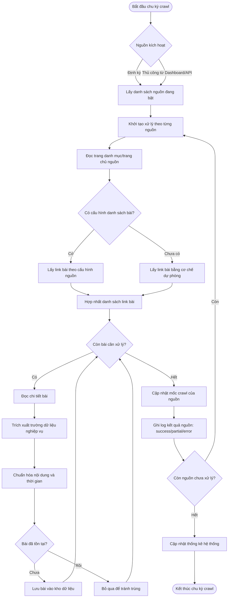

# Kiến trúc & Quy trình Crawl — News Scraper

> Tài liệu này được tạo tự động từ mã nguồn thực tế trong thư mục `backend/`.  
> Cập nhật: 08/05/2026

---

## 1. Tổng quan hệ thống

News Scraper là ứng dụng thu thập bài báo tự động từ **20 nguồn báo tiếng Việt**, lưu vào MongoDB và hiển thị qua giao diện web React.

```
┌─────────────────────────────────────────────────────────────────┐
│  Frontend (React + Vite)  :5173                                  │
│  Bộ lọc ─ Danh sách bài ─ Quản lý nguồn ─ Thêm nguồn           │
└─────────────────────┬───────────────────────────────────────────┘
                      │ HTTP / JSON
┌─────────────────────▼───────────────────────────────────────────┐
│  Backend (FastAPI + Uvicorn)  :8000                              │
│  /api/v1/news      /api/v1/sources      /api/v1/crawl            │
│                                                                   │
│  Scheduler (APScheduler) ──► crawl_active_sources()              │
│  Scraper Engine ──► Fetcher ──► Extractor ──► Normalizer         │
└─────────────────────┬───────────────────────────────────────────┘
                      │ Motor (async driver)
┌─────────────────────▼───────────────────────────────────────────┐
│  MongoDB  :27017  — database: newsdb                             │
│  collections: sources · news · crawl_logs                        │
└─────────────────────────────────────────────────────────────────┘
```

---

## 2. Khởi động ứng dụng

Khi Uvicorn khởi chạy `main.py`, ba bước diễn ra tuần tự thông qua `lifespan`:

```
app start
  ├─ connect_to_mongo()       ← kết nối MongoDB, tạo indexes
  ├─ seed_sources_if_empty()  ← nạp 20 nguồn mặc định nếu DB trống
  └─ start_scheduler()        ← bật scheduler tự crawl định kỳ
```

### Indexes tạo tự động (`db/mongo.py`)

| Collection | Index | Kiểu |
|---|---|---|
| `sources` | `base_url` | Unique |
| `news` | `source_url` | Unique |
| `news` | `published_at` | Giảm dần |
| `news` | `title + content` | Text (full-text search) |
| `crawl_logs` | `crawled_at` | Giảm dần |

---

## 3. Nguồn báo mặc định (Seed)

20 nguồn được nạp vào collection `sources` khi DB trống (`db/seed.py`).  
Tất cả bắt đầu với `is_active: true` và `selectors` rỗng.

| # | Tên | URL | Công cụ thu thập |
|---|---|---|---|
| 1 | VnExpress | https://vnexpress.net | HTTP |
| 2 | Tuoi Tre | https://tuoitre.vn | HTTP |
| 3 | Thanh Nien | https://thanhnien.vn | HTTP |
| 4 | Dan Tri | https://dantri.com.vn | HTTP |
| 5 | Zing News | https://zingnews.vn | HTTP |
| 6 | VietnamNet | https://vietnamnet.vn | HTTP |
| 7 | Nhan Dan | https://nhandan.vn | HTTP |
| 8 | Lao Dong | https://laodong.vn | HTTP |
| 9 | Tien Phong | https://tienphong.vn | HTTP |
| 10 | Nguoi Lao Dong | https://nld.com.vn | HTTP |
| 11 | Phap Luat TP.HCM | https://plo.vn | HTTP |
| 12 | An Ninh Thu Do | https://anninhthudo.vn | HTTP |
| 13 | Suc Khoe Doi Song | https://suckhoedoisong.vn | HTTP |
| 14 | CafeF | https://cafef.vn | HTTP |
| 15 | VnEconomy | https://vneconomy.vn | HTTP |
| 16 | ICTNews | https://ictnews.vn | HTTP |
| 17 | Bao Moi | https://baomoi.com | **Playwright** |
| 18 | Kenh14 | https://kenh14.vn | **Playwright** |
| 19 | GameK | https://gamek.vn | HTTP |
| 20 | BBC Tieng Viet | https://www.bbc.com/vietnamese | HTTP |

---

## 4. Quy trình Crawl chi tiết

### 4.1 Scheduler — tự động định kỳ (`scraper/scheduler.py`)

```
APScheduler (AsyncIOScheduler)
  └─ job: crawl_active_sources
       interval: CRAWL_INTERVAL_MINUTES (mặc định 30 phút)
       max_instances: 1  ← không chạy đè nếu lần trước chưa xong
       coalesce: true    ← gộp các lần bị bỏ lỡ thành 1 lần
```

Biến môi trường điều chỉnh chu kỳ:

```env
CRAWL_INTERVAL_MINUTES=30
```

### 4.2 Luồng crawl toàn bộ (`scraper/engine.py`)

```
crawl_active_sources()
  ├─ Query: sources.find({ is_active: true })
  └─ asyncio.gather(*tasks)   ← crawl song song tất cả nguồn đang bật
       ├─ _crawl_source(nguồn_1)
       ├─ _crawl_source(nguồn_2)
       └─ ...
```

Mỗi nguồn xử lý **độc lập** — lỗi một nguồn không ảnh hưởng các nguồn khác.

### 4.3 Crawl một nguồn: `_crawl_source()` — luồng đầy đủ

```
_crawl_source(source)
  │
  ├─ BƯỚC 1 — Fetch trang chủ
  │     fetch_html_by_crawl_type(crawl_type, base_url)
  │     ├─ crawl_type = "http"       → httpx (async, 30s timeout)
  │     └─ crawl_type = "playwright" → Chromium headless (60s timeout)
  │
  ├─ BƯỚC 2 — Thu thập danh sách link bài
  │     Nếu selector article_list được cấu hình:
  │       extract_article_links(html, css_selector, base_url)
  │     Nếu selector TRỐNG (nguồn mặc định chưa cấu hình):
  │       extract_same_domain_article_links(html, base_url, max=20)
  │       → Heuristic: lấy tối đa 20 link cùng domain
  │         loại bỏ: /video /photo /tag/ /tim-kiem /search
  │
  ├─ BƯỚC 3 — Lặp qua từng link bài (tuần tự)
  │     Fetch HTML bài ─► nếu lỗi mạng → bỏ qua bài đó, status="partial"
  │
  ├─ BƯỚC 4 — Trích xuất dữ liệu bài
  │     Mỗi trường áp dụng CSS selector nếu có, fallback nếu không:
  │
  │     TITLE
  │       1. CSS selector cấu hình (extract_text)
  │       2. Fallback: og:title → twitter:title → h1 → <title>
  │
  │     CONTENT
  │       1. CSS selector cấu hình (extract_text)
  │       2. Fallback: article → main → [role=main]
  │                  → .article__body → .content-detail → body
  │
  │     IMAGE URL
  │       1. CSS selector → attr "content" (og:image kiểu meta)
  │       2. CSS selector → attr "src"
  │       3. Fallback: og:image → twitter:image
  │
  │     AUTHOR      — chỉ CSS selector (max 250 ký tự)
  │     PUBLISHED_AT — CSS selector + normalize_datetime()
  │
  │     ⚠ Bỏ qua bài nếu sau tất cả fallback vẫn không có title VÀ content
  │
  ├─ BƯỚC 5 — Kiểm tra trùng lặp
  │     is_duplicate_source_url(news_collection, article_url)
  │     → Lookup theo source_url (index unique) → bỏ qua nếu đã tồn tại
  │
  ├─ BƯỚC 6 — Chuẩn hóa & lưu DB
  │     clean_text(): xóa ký tự trắng thừa, cắt tối đa 50000 ký tự
  │     normalize_datetime(): parse tự động → UTC; fallback = now()
  │     insert_one(document) vào collection "news"
  │
  ├─ BƯỚC 7 — Cập nhật sources.last_crawled
  │
  └─ BƯỚC 8 — Ghi crawl_log
        { source_id, source_name, crawled_at,
          articles_found, articles_new,
          status: "success" | "partial" | "error",
          error_msg }
```

### 4.4 Trạng thái kết quả crawl

| Trạng thái | Ý nghĩa |
|---|---|
| `success` | Hoàn thành, tất cả bài xử lý được |
| `partial` | Một số bài bị lỗi mạng/không lấy được nội dung, phần còn lại vẫn lưu |
| `error` | Lỗi ở bước fetch trang chủ, toàn bộ nguồn không crawl được |

---

## 5. Hai chế độ thu thập HTML (`scraper/fetcher.py`)

### 5.1 HTTP — `httpx`

- **Khi nào dùng**: `crawl_type = "http"` — trang render HTML phía server
- **Timeout**: 30 giây
- **User-Agent**: giả lập Chrome 123 trên Windows
- **Theo dõi redirect**: có (`follow_redirects=True`)
- **Proxy**: đọc từ biến môi trường (`trust_env=True`)

```python
httpx.AsyncClient(timeout=30, follow_redirects=True, trust_env=True)
  .get(url, headers={"User-Agent": "Chrome/123..."})
```

### 5.2 Playwright (Chromium headless)

- **Khi nào dùng**: `crawl_type = "playwright"` — trang cần JavaScript để render (baomoi.com, kenh14.vn)
- **Timeout**: 60 giây
- **Chờ**: `domcontentloaded` + thêm 1 giây (`wait_for_timeout(1000)`)
- **Lưu ý**: Cần cài `playwright install chromium` trong môi trường chạy

---

## 6. Trích xuất dữ liệu (`scraper/extractor.py`)

### 6.1 Chế độ CSS Selector (mặc định)

Dùng **BeautifulSoup + lxml**. Hỗ trợ toàn bộ cú pháp CSS selector:

```python
# Lấy text của phần tử đầu tiên khớp selector
soup.select_one(".article-title").get_text(" ", strip=True)

# Lấy attribute
soup.select_one('meta[property="og:image"]').get("content")
```

### 6.2 Heuristic (khi chưa cấu hình selector)

**Thu thập link bài** — `extract_same_domain_article_links()`:

```
Duyệt tất cả <a href> trên trang chủ
  ├─ Chuẩn hóa URL (// → https://, /path → base_url + /path)
  ├─ Lọc: chỉ giữ link cùng domain
  ├─ Lọc: bỏ trang chủ chính
  ├─ Lọc: bỏ /video /photo /tag/ /tim-kiem /search
  ├─ Deduplicate (giữ thứ tự xuất hiện đầu tiên)
  └─ Trả về tối đa 20 link
```

**Tiêu đề** — `extract_fallback_title()`:

```
og:title → twitter:title → <h1> → <title>
```

**Nội dung** — `extract_fallback_text_content()`:

```
article → main → [role="main"] → .article__body
       → .content-detail → .detail-content → body
(chỉ lấy nếu text > 80 ký tự)
```

**Ảnh** — `extract_fallback_og_image()`:

```
og:image → twitter:image
```

### 6.3 XPath

Đã khai báo cấu trúc nhưng chưa triển khai (Sprint 1). Nếu selector bắt đầu bằng `/` hoặc `selector_type = "xpath"` → trả về `None`.

---

## 7. Chuẩn hóa dữ liệu (`scraper/normalizer.py`)

### Thời gian — `normalize_datetime()`

```
Chuỗi ngày thô (raw_date)
  ├─ Thử parse tự động: dateutil.parser.parse()
  │    Hiểu được: "2024-01-15", "15/01/2024", "Jan 15, 2024", ISO 8601...
  ├─ Nếu fail + có date_format: datetime.strptime(raw_date, date_format)
  └─ Nếu fail hoàn toàn: dùng datetime.now(UTC)
→ Luôn trả về datetime với timezone UTC
```

### Làm sạch text — `clean_text()`

```
1. Xóa ký tự trắng thừa (tabs, newlines, spaces liên tiếp)
2. Cắt tối đa 50.000 ký tự (200 ký tự khi preview)
3. Trả về None nếu chuỗi rỗng
```

### Dedup — `is_duplicate_source_url()`

```
Lookup: news.find_one({ source_url: url })
→ True nếu đã tồn tại (dùng unique index → O(log n))
```

---

## 8. Cấu trúc dữ liệu MongoDB

### Collection `sources`

```json
{
  "_id": ObjectId,
  "name": "VnExpress",
  "base_url": "https://vnexpress.net",
  "crawl_type": "http",          // "http" | "playwright"
  "selector_type": "css",        // "css" | "xpath"
  "selectors": {
    "article_list": "",          // CSS trỏ đến danh sách link bài
    "title": "",                 // CSS trỏ đến tiêu đề
    "author": "",
    "content": "",
    "published_at": "",
    "image": "",
    "date_format": ""            // Ví dụ: "%d/%m/%Y %H:%M"
  },
  "is_active": true,
  "last_crawled": ISODate,
  "created_at": ISODate
}
```

### Collection `news`

```json
{
  "_id": ObjectId,
  "source_id": "string",
  "source_name": "VnExpress",
  "source_url": "https://vnexpress.net/...",   // unique
  "title": "...",
  "author": "...",
  "content": "...",
  "image_url": "https://...",
  "published_at": ISODate,      // UTC
  "created_at": ISODate         // UTC
}
```

### Collection `crawl_logs`

```json
{
  "_id": ObjectId,
  "source_id": "string",
  "source_name": "VnExpress",
  "crawled_at": ISODate,
  "articles_found": 15,
  "articles_new": 3,
  "status": "success",          // "success" | "partial" | "error"
  "error_msg": null
}
```

---

## 9. API Endpoints

### Tin tức

| Method | Endpoint | Mô tả |
|---|---|---|
| `GET` | `/api/v1/news` | Lấy danh sách bài, hỗ trợ filter + pagination |
| `GET` | `/api/v1/stats` | Thống kê tổng bài, nguồn đang bật, lần crawl cuối |

**Query params** của `/news`:

| Param | Kiểu | Mô tả |
|---|---|---|
| `q` | string | Tìm full-text (MongoDB `$text`) trên title + content |
| `from` | ISO datetime | Lọc `published_at >= from` |
| `to` | ISO datetime | Lọc `published_at <= to` |
| `source_id` | string | Lọc theo nguồn |
| `page` | int (≥1) | Trang hiện tại, mặc định 1 |
| `limit` | int (1–100) | Số bài mỗi trang, mặc định 20 |

### Quản lý nguồn

| Method | Endpoint | Mô tả |
|---|---|---|
| `GET` | `/api/v1/sources` | Lấy toàn bộ nguồn |
| `POST` | `/api/v1/sources` | Tạo nguồn mới |
| `PATCH` | `/api/v1/sources/{id}` | Cập nhật (bật/tắt, sửa selector) |
| `DELETE` | `/api/v1/sources/{id}` | Xóa nguồn |

### Crawl

| Method | Endpoint | Mô tả |
|---|---|---|
| `POST` | `/api/v1/crawl/trigger` | Crawl tất cả nguồn đang bật (async song song) |
| `POST` | `/api/v1/crawl/trigger/{id}` | Crawl một nguồn theo ID |
| `POST` | `/api/v1/crawl/preview` | Test selector trên một URL cụ thể (không lưu DB) |

### Health

| Method | Endpoint | Mô tả |
|---|---|---|
| `GET` | `/health` | Kiểm tra kết nối MongoDB |

---

## 10. Thêm nguồn mới — hướng dẫn

### Cách 1: Qua giao diện web

1. Mở **http://localhost:5173/them-nguon**
2. Điền Tên + URL trang chủ
3. Chọn công cụ: **HTTP** (trang tĩnh) hoặc **Playwright** (trang JS)
4. Điền CSS selector cho từng trường _(có thể để trống — heuristic sẽ xử lý)_
5. Dán URL một bài cụ thể → **Xem thử selector** để kiểm tra
6. Nhấn **Lưu nguồn**

### Cách 2: Qua API

```bash
curl -X POST http://localhost:8000/api/v1/sources \
  -H "Content-Type: application/json" \
  -d '{
    "name": "Tên báo",
    "base_url": "https://example.com",
    "crawl_type": "http",
    "selector_type": "css",
    "selectors": {
      "article_list": "a.article-title",
      "title": "h1.post-title",
      "author": ".author-name",
      "content": ".article-body",
      "published_at": ".publish-date",
      "image": "meta[property=\"og:image\"]",
      "date_format": ""
    }
  }'
```

### Gợi ý tìm CSS selector

```
1. Mở trang chủ báo trong Chrome
2. Chuột phải vào một link bài → Inspect
3. Tìm selector chung cho tất cả link bài (ví dụ: ".article-list a")
4. Mở một bài cụ thể → lặp lại cho title, content, author...
5. Dán vào form "Xem thử selector" để kiểm tra trước khi lưu
```

---

## 11. Biến môi trường (`.env`)

```env
# MongoDB
MONGODB_URI=mongodb://mongodb:27017   # docker-compose
MONGODB_DB=newsdb

# Backend
BACKEND_PORT=8000
CRAWL_INTERVAL_MINUTES=30            # chu kỳ tự crawl (phút)

# Frontend
VITE_API_BASE_URL=http://localhost:8000/api/v1
```

---

## 12. Sơ đồ luồng dữ liệu tóm tắt

```
Scheduler (30 phút)
        │
        ▼
crawl_active_sources()
  ├──────────────────── song song (asyncio.gather) ────────────────────┐
  │                                                                      │
  ▼                                                                      ▼
_crawl_source(A)                                              _crawl_source(B)
  1. fetch trang chủ                                            1. fetch trang chủ
     httpx / Playwright                                            httpx / Playwright
  2. extract links                                              2. extract links
     CSS selector                                                  heuristic (nếu trống)
     hoặc heuristic (nếu trống)
  3. lặp từng link
     fetch HTML bài
     extract: title / author / content / image / date
     fallback khi thiếu selector (og: tags, h1, article...)
     dedup check (source_url unique index)
     clean text + normalize date
     insert vào MongoDB "news"
  4. update last_crawled
  5. ghi crawl_log
        │
        ▼
  MongoDB "news"  ──►  GET /api/v1/news  ──►  Frontend React
```

---

## 13. Sơ đồ BPMN nghiệp vụ crawl (business flow)

> Mục tiêu của sơ đồ này là mô tả **quy trình nghiệp vụ** từ lúc hệ thống kích hoạt crawl cho tới khi dữ liệu khả dụng trên giao diện, không đi vào chi tiết kỹ thuật từng hàm.



### Ý nghĩa nghiệp vụ chính của BPMN

- Quy trình có thể được kích hoạt từ **hai kênh**: định kỳ hoặc thủ công.
- Mỗi nguồn là một đơn vị xử lý độc lập, giúp hệ thống có khả năng chịu lỗi tốt.
- Có nhánh xử lý cho nguồn đã cấu hình đầy đủ và nguồn chưa cấu hình đầy đủ.
- Mỗi bài đều đi qua bước chuẩn hóa và loại trùng trước khi lưu.
- Kết quả cuối chu kỳ luôn tạo log theo nguồn để phục vụ giám sát chất lượng crawl.
